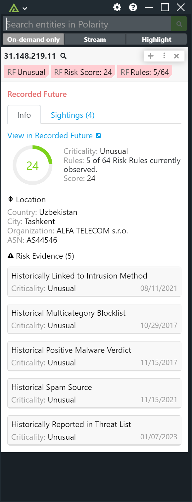

# Polarity Recorded Future Integration

Polarity integration for searching Recorded Future for associated threat information.

## Recorded Future Integration Options

### Recorded Future API Key

API Key associated with Recorded Future account.

### Minimum Score

Minimum risk score a threat needs to have in order to be displayed.

### Ignored Domains

Comma delimited list of domains that you do not want to lookup.

### Domain Ignore List Regex

Domains that match the given regex will not be looked up (if blank, no domains will be ignored)

### IP Ignore List Regex

IPs that match the given regex will not be looked up (if blank, no IPs will be ignored)

### Max Concurrent Requests

Maximum number of concurrent requests.  Integration must be restarted after changing this option. Defaults to 25.

### Minimum Time Between Lookups

Minimum amount of time in milliseconds between lookups.  Integration must be restarted after changing this option. Defaults to 50.

## Installation Instructions

Installation instructions for integrations are provided on the [PolarityIO GitHub Page](https://polarityio.github.io/).

## Polarity

Polarity is a memory-augmentation platform that improves and accelerates analyst decision making.  For more information about the Polarity platform please see:

https://polarity.io/
